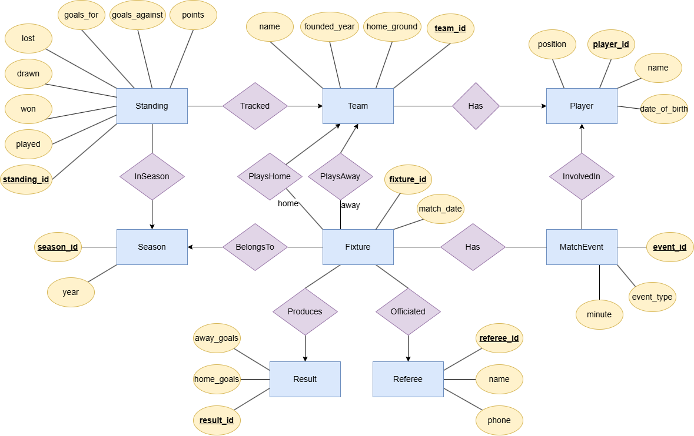

# league-manager
A console-based football league manager built with Python and MySQL

## Requirements
- Python 3.10+
- MySQL Server
-  mysql-connector-python

## Setup
1. Run schema.sql in MySQL Workbench to create the database
2. Run seed.sql to populate with test data
3. Run triggers_procedures.sql to create the trigger and procedure
4. Install the Python library: pip install mysql-connector-python
5. Copy config.example.py to config.py and enter your MySQL password
6. Run the app: python main.py

## ER Diagram

